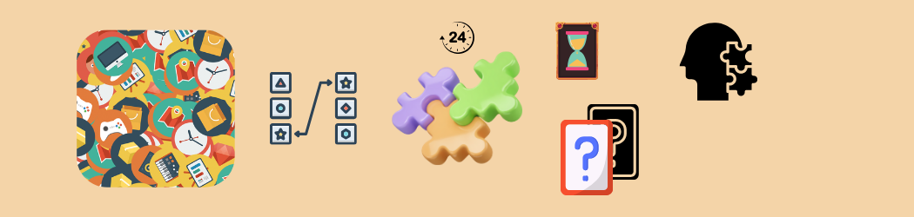
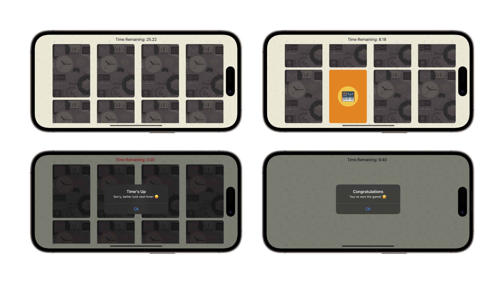
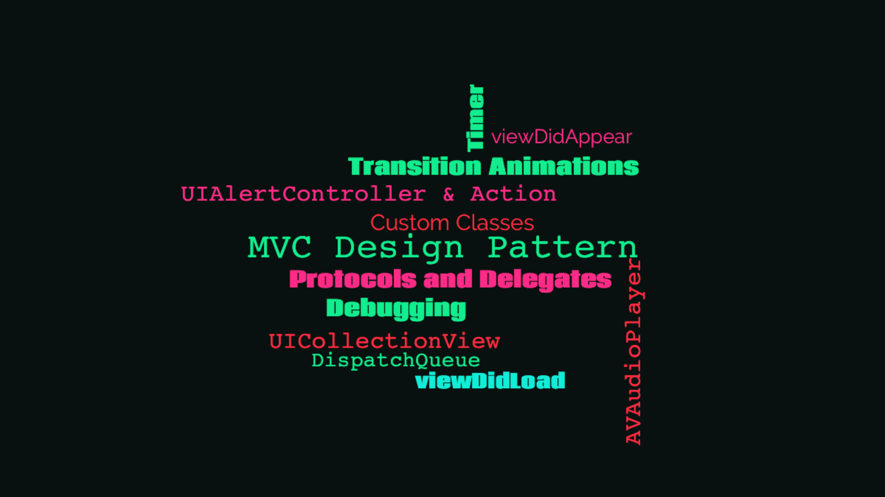
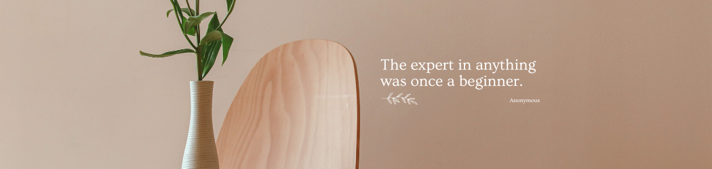

    
    
    

## About the app

### Match

A card game app that consists of multiple card pairs with the same image, which are required to be match before the timer countdown ends.

The game contains a total of 8 card pairs and each pair contains the same card image. To win, the player has to simply match all the card pairs before the timer stops, which is set to a countdown of 30 seconds. If the timer ends with any un-matched cards left, the player loses the round.

 ##### *Built in [Swift](https://developer.apple.com/swift/) & [UIKit](https://developer.apple.com/documentation/uikit) with the [AVFoundation](https://developer.apple.com/documentation/avfoundation/) framework to play in-app custom sound effects and a project architecture in the [Model–View–Controller](https://developer.apple.com/library/archive/documentation/General/Conceptual/DevPedia-CocoaCore/MVC.html#//apple_ref/doc/uid/TP40008195-CH32-SW1) (MVC) design pattern.*

    

## Concepts learned

    

## Credits

##### Swift, UIKit, Xcode, SF Symbols, Cocoa Touch, Safari, App Store, iPhone & iOS, iPad & iPadOS, Apple Watch & watchOS, Apple TV & tvOS, Mac & macOS and their logos are trademarks of Apple Inc., registered in the U.S. and other countries.

