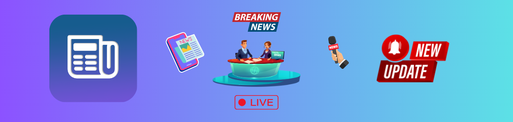
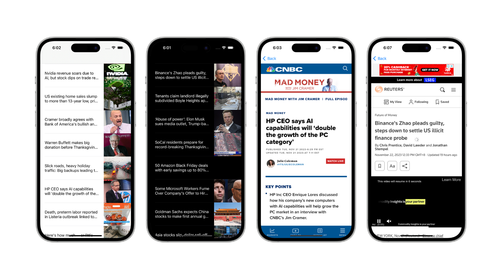
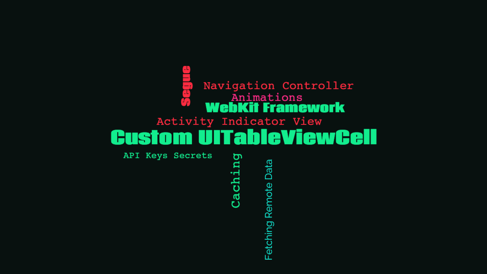
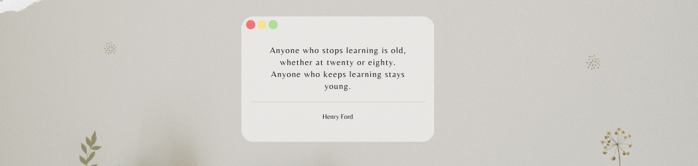

    
    
    
    

## About the app

### Newscast

A news app that locates articles and breaking news headlines from news sources and blogs across the web.

All news article contents are fetched from the [News API](https://newsapi.org) and displayed in-app in a custom table view layout. To view any news article, simply tap on your selected option and a web view will display the full article in-app.

Multiple popular news sources are featured in this app, such as, but not limited to, WSJ, Reuters, CNN, CNBC, Financial Times, etc. All reporting news featured in the Newscast App are up-to-date with current world events.

 ##### *Built in [Swift](https://developer.apple.com/swift/) & [UIKit](https://developer.apple.com/documentation/uikit) featuring the [WebKit](https://developer.apple.com/documentation/webkit) framework to display news content in-app, networking to retrieve remote data from the [News API](https://newsapi.org) using [URLSession](https://developer.apple.com/documentation/foundation/urlsession/), caching to reduce user bandwidth network consumption, and a project architecture in the [Model–View–Controller](https://developer.apple.com/library/archive/documentation/General/Conceptual/DevPedia-CocoaCore/MVC.html#//apple_ref/doc/uid/TP40008195-CH32-SW1) (MVC) design pattern.*

    

## Concepts learned

    

## Credits

##### Swift, UIKit, Xcode, SF Symbols, Cocoa Touch, Safari, App Store, iPhone & iOS, iPad & iPadOS, Apple Watch & watchOS, Apple TV & tvOS, Mac & macOS and their logos are trademarks of Apple Inc., registered in the U.S. and other countries.

