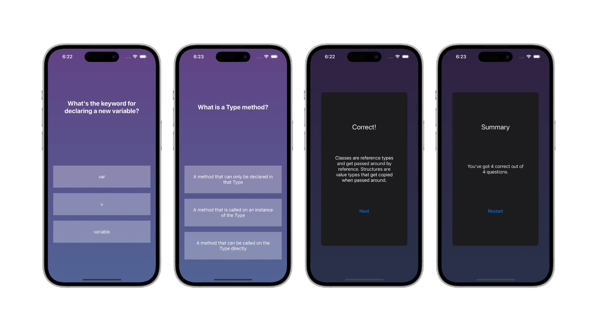

    
    
    

## About the app

### Quizzler

A quiz app featuring multiple questions that tests your [Swift](https://developer.apple.com/swift/) programming language knowledge.

The quiz contains a set number of questions where users have to asnwer each question before proceeding to the next question. After answering each question, the user will be presented with a popup window indicating the result of their answer.

The popup window contains information on whether the user answered correctly, along with an explanation of why their answer is correct or wrong.

At the end of quiz, a popup window will show the user's summary quiz result with how many of the total questions they got correct.

 ##### *Built in [Swift](https://developer.apple.com/swift/) & [UIKit](https://developer.apple.com/documentation/uikit) with an app state persistance feature using [UserDefaults](https://developer.apple.com/documentation/foundation/userdefaults), networking to retrieve remote data from an API using [URLSession](https://developer.apple.com/documentation/foundation/urlsession/), and a project architecture in the [Model–View–Controller](https://developer.apple.com/library/archive/documentation/General/Conceptual/DevPedia-CocoaCore/MVC.html#//apple_ref/doc/uid/TP40008195-CH32-SW1) (MVC) design pattern.*

    

## Concepts learned

    

## Credits

##### Swift, UIKit, Xcode, SF Symbols, Cocoa Touch, Safari, App Store, iPhone & iOS, iPad & iPadOS, Apple Watch & watchOS, Apple TV & tvOS, Mac & macOS and their logos are trademarks of Apple Inc., registered in the U.S. and other countries.

