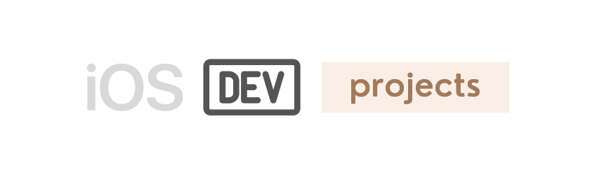
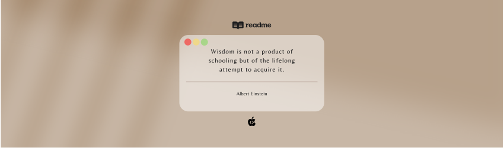

### Overview

My personal app development projects built with the iOS SDKs using *[Swift](https://developer.apple.com/swift/)* and *[SwiftUI](https://developer.apple.com/xcode/swiftui/)*, with some projects using various other frameworks like UIKit, MapKit, etc.

This repo contains mostly smaller scale projects.

#### SwiftUI Apps:
- [Citysights](Citysights/) - Shows popular locations & venues in the city based on your nearby location.

- [Guidebook](Guidebook/) - Simpler version of Citysights app, with a fixed data set of city guides.

- [Restaurant](Restaurant/) - A sushi restaurant app with tab bar navigation and image gallery with sheet overlay display.

- [Movie](Movie/) - Simple scrollable list of movies with different tab views.

- [Menu](Menu/) - Simpler version of Restaurant app, with only a scrollable list of food items.

- [War](War/) - Playing card game app that randomly draws and compare their strength against each other.

#### UIKit Apps:
- [Quizzler](Quizzler/) - Quiz app for testing your knowledge on Swift programming language concepts.

- [Newscast](Newscast/) - News app that retrieves latest breaking news from across the web through an API.

- [Match](Match/) - Card game app with a win condition to match all card pairs before the timer runs out.

 ##### *Note: Most recent project are added to the top of the list.*

## Credits
 
##### *Swift, SwiftUI, UIKit, Xcode, SF Symbols, Cocoa Touch, Safari, App Store, iPhone & iOS, iPad & iPadOS, Apple Watch & watchOS, Apple TV & tvOS, Mac & macOS and their logos are trademarks of Apple Inc., registered in the U.S. and other countries.*

