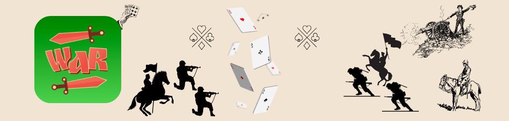
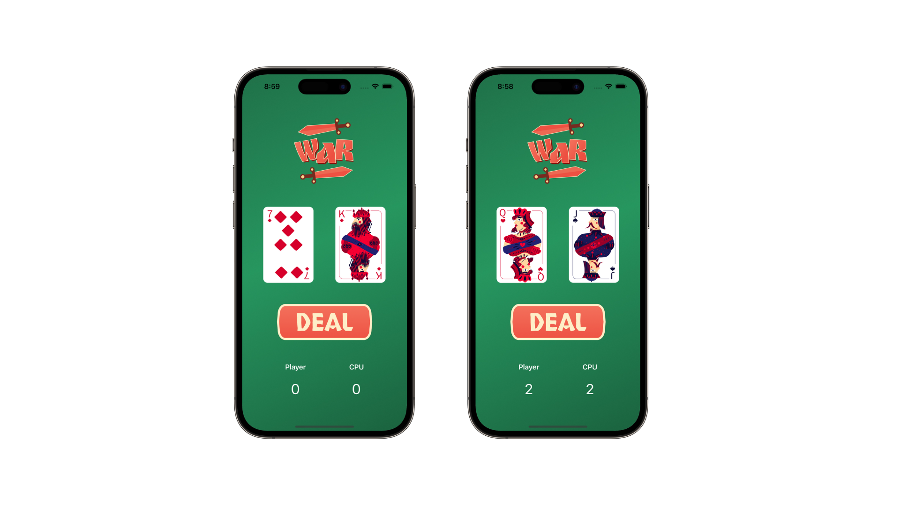
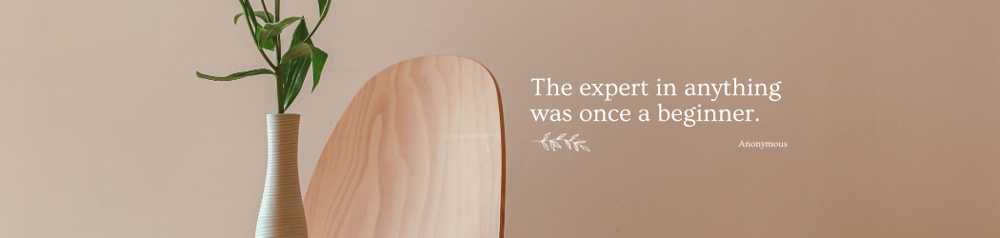

## About the app

### War

War is a card-dueling app where the player and the CPU draws a random card each round. Depending on the cards drawn, both cards are compared against each other to determine the winner of the round and the winner of each round is awarded a point.

Types of cards used in this app are the common playing card found in the [french-suited, standard 52-card deck](https://en.wikipedia.org/wiki/Playing_card).

    

## Concepts learned

    

## Credits

##### *Swift, SwiftUI, Xcode, SF Symbols, Cocoa Touch, Safari, App Store, iPhone & iOS, iPad & iPadOS, Apple Watch & watchOS, Apple TV & tvOS, Mac & macOS and their logos are trademarks of Apple Inc., registered in the U.S. and other countries.*

