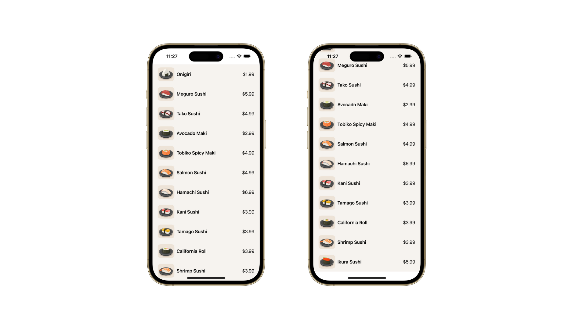

## About the app

    

### Menu

Menu is a simple scrollable list of sushi items that contains the individual item's data; image, item name and price. There are no other interactice features within the besides being scrollable.

The purpose of this app was simply to practice multiple concepts of app-building such as, but not limited to, displaying data in a scrollable list, app architecture, data modelling, UI-building, applying the D.R.Y (Don't Repeat Yourself) methodology in code, along with some basic Swift concepts such as Arrays & Structures.

## Concepts learned

    

## Credits

Swift, the Swift logo, Xcode, SF Symbols, Cocoa Touch, iPhone, iPad, Safari, App Store, watchOS, tvOS, Mac and MacOS are trademarks of Apple Inc., registered in the U.S. and other countries.

