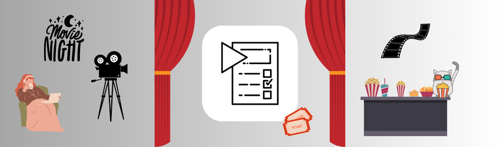
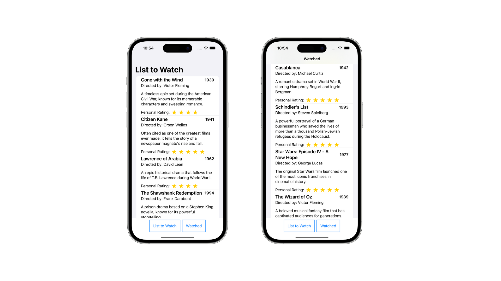
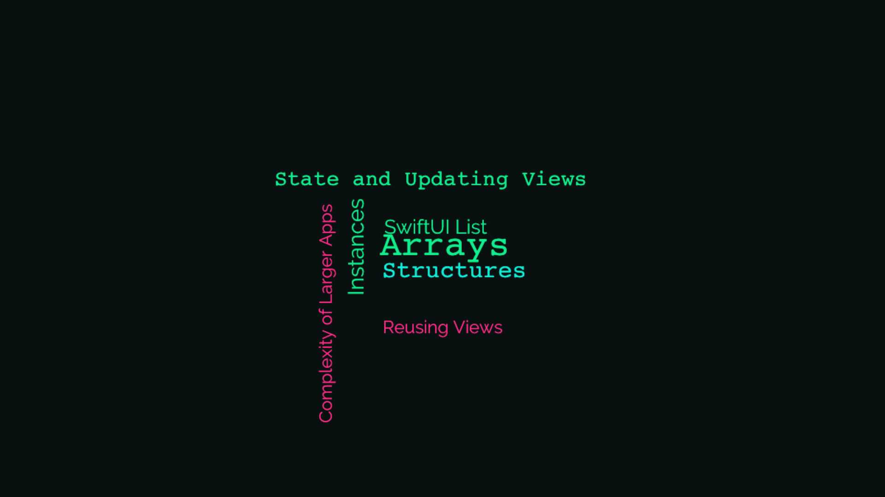

## About the app

    

### Movie

Movie is a simple tracker app with scrollable list of movies that contains the title's data such as name, description, rating, and more. The app consists of two different lists; list of movies to watch and movies watched.

Two button sits below the list that will display the relevant list of movies, depending on which button is tapped.

## Concepts learned

    

## Credits

Swift, the Swift logo, Xcode, SF Symbols, Cocoa Touch, iPhone, iPad, Safari, App Store, watchOS, tvOS, Mac and MacOS are trademarks of Apple Inc., registered in the U.S. and other countries.

