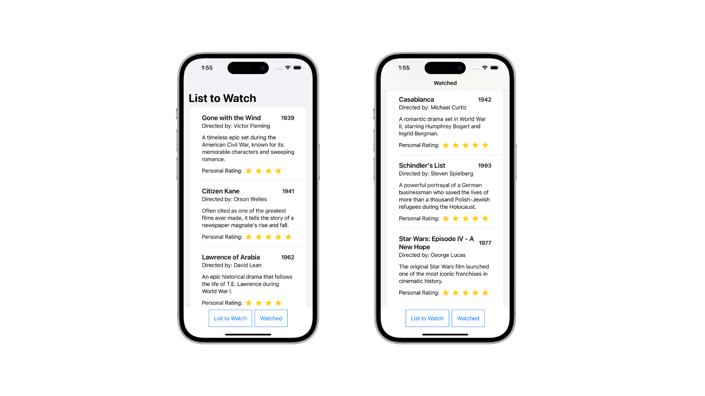

## About the app

### Movie

Movie is a simple tracker app with scrollable list of movies that contains the title's data such as name, description, rating, and more. The app consists of two different lists; list of movies to watch and movies watched.

Two button sits below the list that will display the relevant list of movies, depending on which button is tapped.

    

## Concepts learned

    

## Credits

##### *Swift, SwiftUI, Xcode, SF Symbols, Cocoa Touch, Safari, App Store, iPhone & iOS, iPad & iPadOS, Apple Watch & watchOS, Apple TV & tvOS, Mac & macOS and their logos are trademarks of Apple Inc., registered in the U.S. and other countries.*

