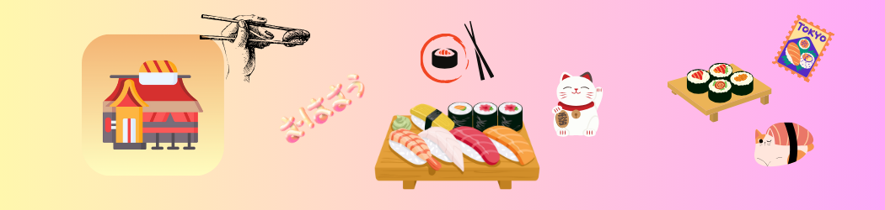
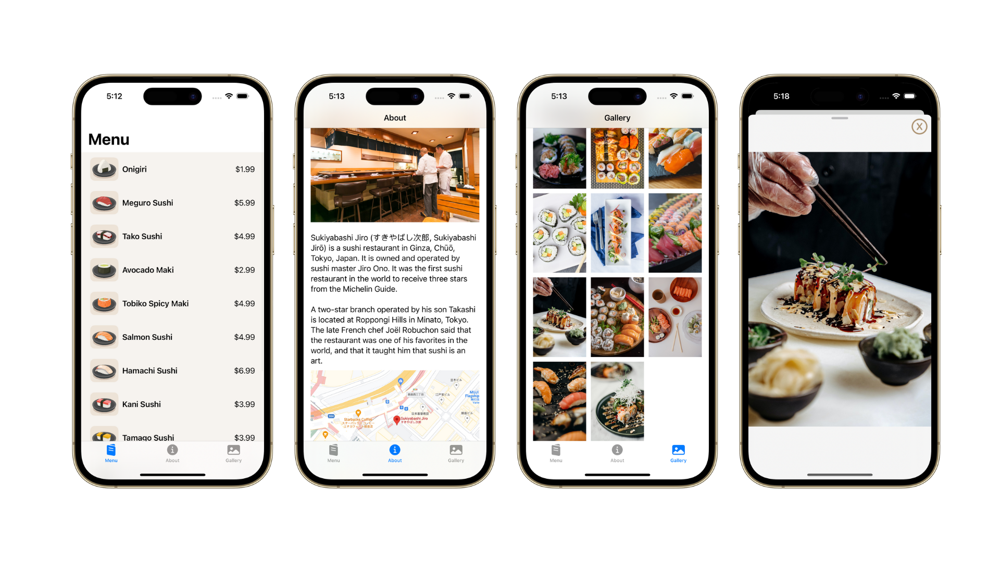
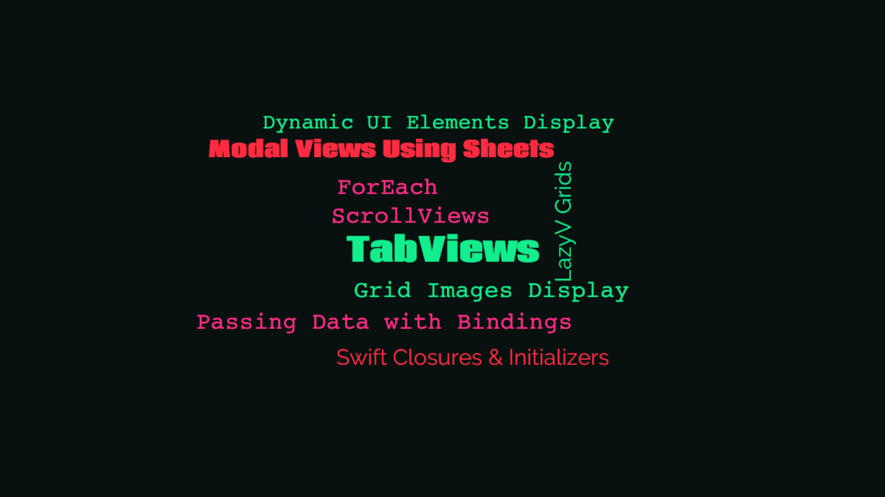
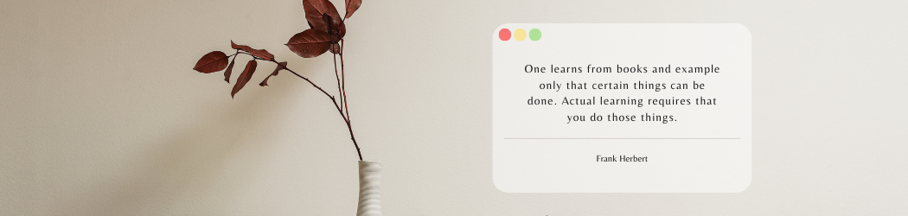

## About the app

    
    <video src="DocAssets/AppPreview.mp4"></video>

### Movie

Restaurant is a sushi restaurant app that contains multiple screens about the details of the restaurant. It consists of tab bar that allow users to navigate between the different screens, with one of the screens containing a gallery view of the restaurant's food.

The images in the gallery are also interactable; Users can simply tap on any image and they can view an enlarged version of the image.

## Concepts learned

    

## Credits

Swift, the Swift logo, Xcode, SF Symbols, Cocoa Touch, iPhone, iPad, Safari, App Store, watchOS, tvOS, Mac and MacOS are trademarks of Apple Inc., registered in the U.S. and other countries.

