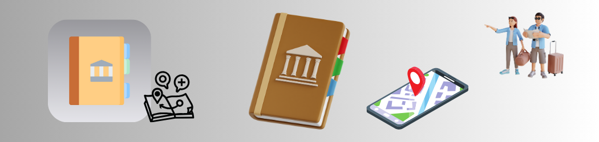

## About the app

### Guidebook

Guidebook is a city guide app that contains a list of popular attractions local to the area.

The app contains 3 different screens that starts off from selecting a city and simply tapping on it reveals the next screen for a list of local attractions.

After tapping on an attraction, the next screen will display more info on the selected attraction and a button that redirects the user to the Map App with the precise location, along with other info such as user-submitted reviews, photos, ratings, etc.

##### Note: *As of this writing, there is only a pre-determined number of cities and attractions in the app as the data is parsed from a JSON file that sits locally within the app bundle. More cities & attractions can always be added by simply adding the data to the JSON file.*

    
    <video src="DocAssets/AppPreview.mp4"></video>

## Concepts learned

    

## Credits

##### *Swift, SwiftUI, Xcode, SF Symbols, Cocoa Touch, Safari, App Store, iPhone & iOS, iPad & iPadOS, Apple Watch & watchOS, Apple TV & tvOS, Mac & macOS and their logos are trademarks of Apple Inc., registered in the U.S. and other countries.*

