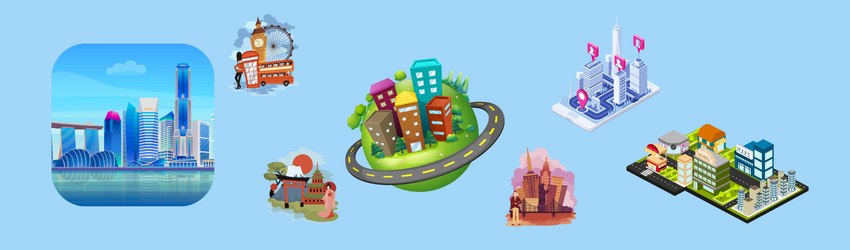
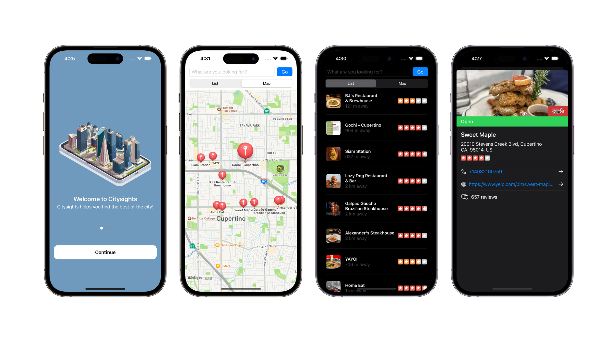
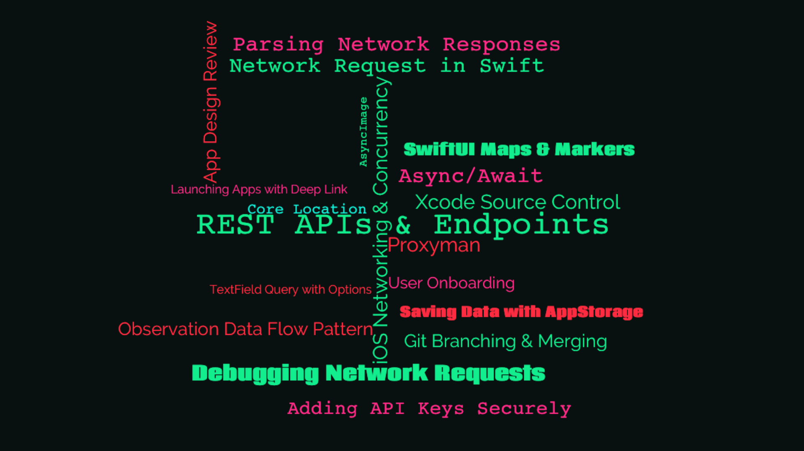

    
    
    
    

## About the app

### Citysights

A city guide app that shows you nearby local city attractions and venues, based on your current location. 

Through a simple onboarding process with a prompt to request your location permission, the app's home screen will show a list of nearby locations with a default category set to display a list of restaurants. You can also switch to a map view of nearby locations, simply by tapping on the "Map" tab.

To personalize your search, simply type a keyword such as "cafe" or "club" in the search bar and choose a matching category to display matching locations of your query. Two optional selection; Popular & Deals are included to further refine your search of nearby locations.

For viewing any specific location from your search result, simply tap on any business in the list, or map marker if you're in the map view, to display an overlay of the business detail page.

 ##### *Built in [Swift](https://developer.apple.com/swift/) & [SwiftUI](https://developer.apple.com/xcode/swiftui/), featuring [MapKit](https://developer.apple.com/documentation/mapkit/) & [Core Location](https://developer.apple.com/documentation/corelocation/) frameworks, with the [Yelp Fusion API](https://fusion.yelp.com), [Async/Await](https://docs.swift.org/swift-book/documentation/the-swift-programming-language/concurrency/) concunrrecy, [Observation](https://developer.apple.com/documentation/observation) data flow pattern, and a MVVM architectural design pattern.*

    
    <video src="DocAssets/AppPreview.mp4"></video>

## Concepts learned

    

## Credits

Swift, SwiftUI, Xcode, SF Symbols, Cocoa Touch, Safari, App Store, iPhone & iOS, iPad & iPadOS, Apple Watch & watchOS, Apple TV & tvOS, Mac & macOS and their logos are trademarks of Apple Inc., registered in the U.S. and other countries.

